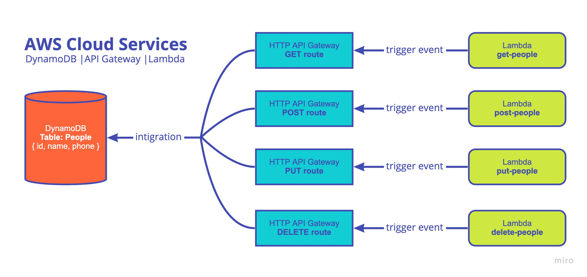

# Lab 18 | AWS: API, Dynamo and Lambda | 401 JavaScript
# Author: Lydia Minehan-Tubic

## Links & Resources

✨ [Pull Request]()

✨ [API Base URL](https://3l7shcchfb.execute-api.us-west-2.amazonaws.com/people)

✨ [GET lambda]() | [POST lambda]() | [PUT lambda]() | [DELETE lambda]()

## Feature Tasks

Create a single resource REST API using a domain model of your choosing, constructed using AWS Cloud Services

✨ AWS Cloud Services: DynamoDB, API Gateway, Lambda Functions

✨ Dependencies: uuid, dynamoose

- Create one table for one data model at DynamoDB
- Create a `Dynamoose` schema to define the structure of your table
- Write lambda functions that will separately perform the proper CRUD operation on the database
- Create your routes using API Gateway
  - Routes should integrate with the appropriate Lambda function to perform the operation
- Once you can assert the type of data coming back from Dynamoose and the type of input you’ll get from the API in the `event`, write the test cases for each Lambda function

## Documentation

- **DynamoDB:**
  - `Create table`: Give it a name and a key of `id`
  - On the table you created, `create item`
  - Add your table columns: `id`, `name`, `phone`
- **API Gateway:**
  - Select `HTTP API`
  - Name your API, and keep the default settings for the remaining questions
  - Once you've created your API, click `routes`
  - Create routes for `GET`, `POST`, `PUT`, and `DELETE`
    - Name your route appropriately i.e. `/people`
    - NOTE: Once your routes are created, you will need to edit the route details for integration with Lambda
      - Click `Attach integration`
      - Attach the appropriate integration to the route you have selected
- **Lambda:** 
  - We're now going to create 4 functions for each of the routes. Name them `get-people` etc to stick with a clean naming convention
  - Add an API gateway trigger to each of your lambda functions
    - Select the corresponding API aka `people`
    - Deployment stage: `$default`
    - Security: `Open`
  - It's time to write your Lambda functions in a text editor
    - In one repository, make 4 folders: get, post, put, delete
    - In each folder: 
      - Name your top level file `index.js`
      - create a `people.schema.js`
      - `npm i uuid dynamoose`
    - Write your lambda functions and build your schemas
    - Zip each route folder
    - Upload each route folder to its corresponding lambda in AWS
- **Role Permissions:**
  - Your lambdas will naturally create new roles that need to have the correct permissions
  - Navigate to IAM, and go to Roles
  - Under roles, find the roles that were created from your lambdas
    - They will have a formatting like `post-people-role-ferbjwebr`, for example
  - Give all four roles these permissions:
    - AmazonDynamoDBFullAccess
    - AdministratorAccess
    - AWSLambda_FullAccess
    - AmazonAPIGatewayAdministrator

**CRUD KEY**
- POST = create
- GET = read
- PUT = update
- DELETE = delete

Test your routes in swagger:
- GET and POST can be done in 'body' on swagger
- PUT and DELETE will need a query paramater of id and the id number
  - PUT will also require changes to body

## Data Architecture




```json
// Lambda Test
{
    "body": "{\"id\": \"123456789\", \"name\": \"test_user\", \"phone\": \"123 456 7890\"}"
}

// Query body
{
  "id": "12345",
  "name": "test name",
  "phone": "123-456-7890"
}
```

## Sources, Resources, & References

- [Model | Dynamoose](https://dynamoosejs.com/guide/Model/)
- [Query | Dynamoose](https://dynamoosejs.com/guide/Query/)
- [Condition | Dynamoose](https://dynamoosejs.com/guide/Condition/#conditioneqvalue)